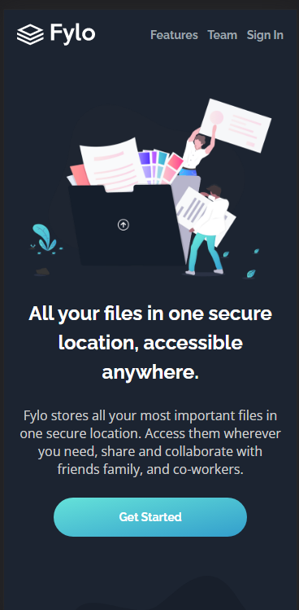
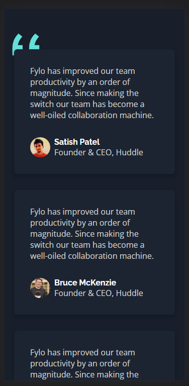
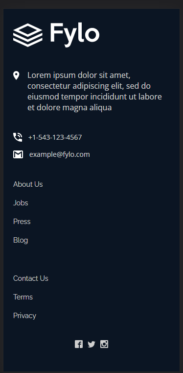
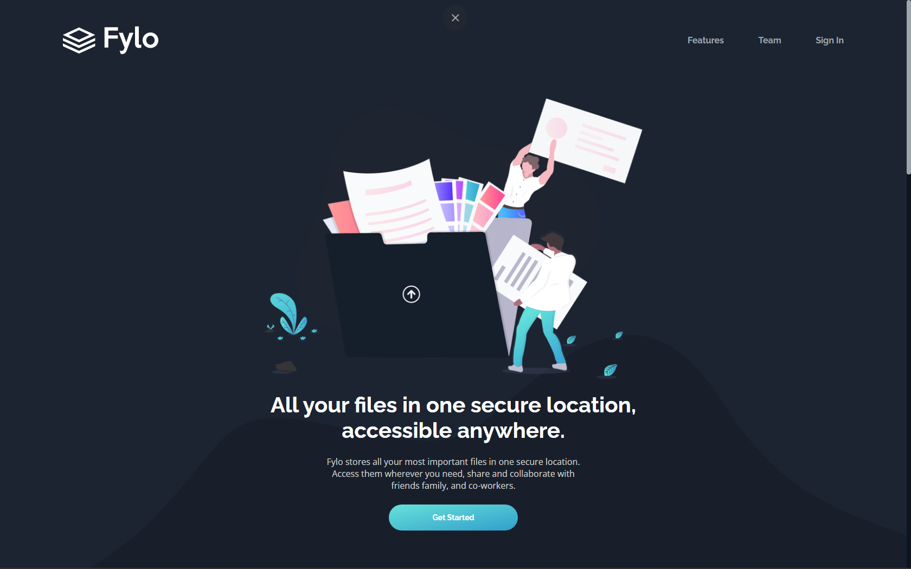
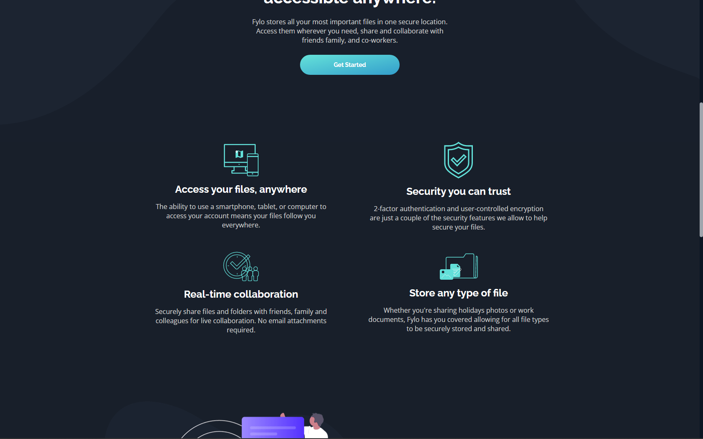
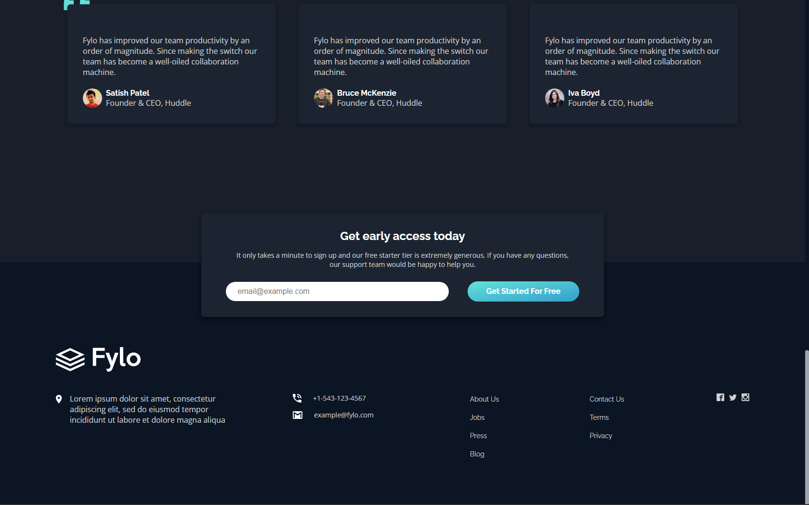

# Netflix Landing Page Clone

<div>
  
  
  
</div>
<div>
  
  
  
</div>

📌 This project is a [Frontend Mentor](https://www.frontendmentor.io/challenges) challenge, from their free tier membership.

**Responsive on mobile and dekstops**

## 😎 Watch live

[](https://roaring-unicorn-9c1473.netlify.app)

## 🏠 Run Locally

Clone the project

```bash
  git clone https://github.com/K1riakos/fylo-website-fem
```

Go to the project directory

```bash
  cd fylo-website-fem
```

<br>

## ⚙️ Used

<br>

**👉 Coding**


<br>

**🖥️ Editor**


<br>

**🛠️ Version Control**


<br>

## 🙋🏻‍♂️ Author

**Kyriakos Kiri Sidiropoulos**
